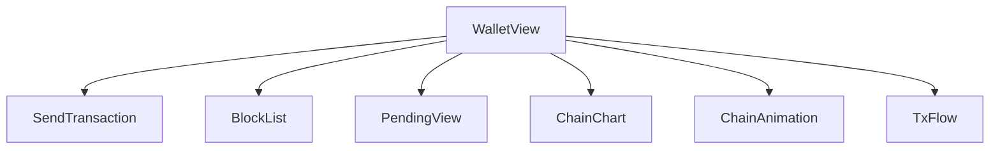
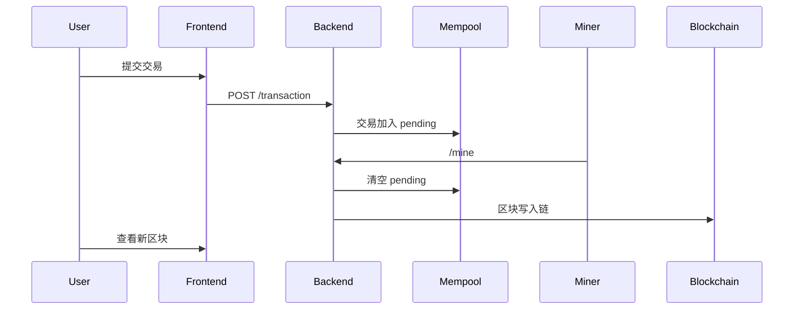
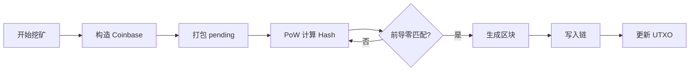

# 基于 Python + Vue 的区块链系统设计与实现  
---

## 目录  
1. 引言  
2. 设计目标与需求分析  
3. 系统总体架构  
4. 数据结构与核心模型设计  
5. 后端实现（Python Blockchain Core）  
6. 前端实现（Vue3 + Element Plus）  
7. 区块链核心流程分析  
11. 结论与展望  
12. 附录：API 文档、运行方式

---

## 1. 引言

区块链技术自 2008 年比特币问世以来，已成为现代数字经济体系的核心基础设施之一。本项目构建了一个迷你但完整的区块链系统，包括：

- 区块结构（Block）
- UTXO 交易模型
- 数字签名机制（ECDSA）
- 工作量证明（PoW）
- Mempool（未确认交易池）
- 区块链浏览器
- 可视化动画（区块飞入、交易流转）
- Vue 前端钱包系统

本系统采用 Python 作为后端开发语言，实现了基于 UTXO 模型的交易结构、工作量证明（Proof-of-Work）挖矿机制、区块链数据结构、数字签名与钱包体系等核心模块。与常规仅关注链上数据结构的课程设计不同，本项目同时引入了 Vue3 前端框架，构建了一个具有可视化能力的区块链交互界面。用户不仅能够创建钱包、发起交易、参与挖矿，还可以通过动画化呈现的方式观察交易从 Mempool 到区块打包、区块飞入链结构的动态过程，从而加深对区块链运行机制的理解。

---

## 2. 设计目标与需求分析

### 2.1 设计目标
本项目的总体目标是构建一个可运行、可交互、可展示、可扩展的迷你区块链系统。目标包括：

- 完整实现链式数据结构
- 实现 UTXO 模型的交易系统
- 支持数字签名与验签
- 实现 PoW 挖矿与动态难度校验
- 提供 RESTful API 供前端调用
- 前端提供可视化区块链浏览器
- 增加交易流转动画、区块飞入动画
- 支持钱包生成、导入、余额查询

### 2.2 功能需求分析

（1）功能性需求

| 模块 | 描述 |
|------|------|
| 钱包系统 | 生成私钥、公钥、地址；导入钱包 |
| 交易系统 | 创建交易、签名交易、广播交易 |
| UTXO 系统 | 维护账户余额、交易输入引用 |
| 区块系统 | 生成区块、PoW 挖矿、链校验 |
| 区块链 | 维护链状态、查询区块 |
| Mempool | 存储待确认交易 |
| 可视化 | 区块飞入动画、链图表、交易流展示 |

（2）非功能性需求

- 系统应可读性强、易维护、高扩展性    
- 支持 API 调用与组件解耦  

---

## 3. 系统总体架构

系统采用 **前后端分离架构**。

---

### 3.1 系统架构图（Mermaid）

---

### 3.2 模块分层

#### 前端（Vue3）
- 钱包管理器 WalletManager
- 区块链浏览器 BlockList
- Mempool PendingView
- 区块可视化 ChainAnimation
- 交易流动画 TxFlow
- 图表展示 ChainChart

#### 后端（Flask）
- /transaction 创建交易
- /tx/create_signed 创建并签名交易
- /mine 挖矿
- /blocks 获取链全部区块
- /pending 获取 Mempool
- /balance/<address> 查询余额
- /create_wallet 生成钱包

---

## 4. 数据结构与核心模型设计

### 4.1 Block（区块结构）
```python
class Block:
    index: int
    prev_hash: str
    transactions: list
    timestamp: int
    nonce: int
    difficulty: int
    hash: str
```

区块哈希由以下拼接：

```
index + prev_hash + timestamp + 所有交易ID + nonce
```

通过双 SHA256 计算。

---

### 4.2 Transaction（交易结构）
交易包含输入与输出：

输入

```python
(txid, index, signature)
```

输出

```python
(amount, address)
```

每个交易唯一由：

```
序列化字符串 → SHA256
```

得到 txid。

---

### 4.3 UTXO 模型

UTXOSet 维护所有地址未被花费的输出：

```python
{ address: [ {txid, index, amount} ] }
```

UTXO 模型的优势：
- 不需要账户余额字段
- 去中心化验证交易更方便
- 可并行验证

---

## 5. 后端实现（Python Blockchain Core）

本系统后端由以下模块组成：

- block.py — 区块结构与挖矿
- blockchain.py — 区块链主体逻辑
- transaction.py — 交易与序列化
- utxo.py — UTXO 状态维护
- wallet.py — ECDSA 数字签名钱包
- api.py — RESTful API 服务器

---

### 5.1 Block：挖矿过程（PoW）

```python
while True:
    self.hash = self.calculate_hash()
    if self.hash.startswith("0" * difficulty):
        break
    self.nonce += 1
```

本实现采用简单的前导零匹配作为 PoW。

---

### 5.2 Blockchain：挖矿流程

```text
1. 构造 coinbase 奖励交易
2. 取出 Mempool 交易 + coinbase 打包成区块
3. 挖矿
4. 将区块加入 chain
5. 对区块中的所有交易统一更新 UTXOSet
6. 清空 pending
```

Coinbase 奖励为固定值：**50 BTC**。

---

### 5.3 交易创建过程

```text
1. 查询 from_address 的余额（UTXO 查找）
2. 若不足则返回错误
3. 构造 TXInput 列表（引用 UTXO）
4. 构造 TXOutput（支付 + 找零）
5. 加入 pending_transactions
```

真实系统中还需要验证签名，本项目中已实现签名生成。

---

### 5.4 钱包系统（ECDSA）

钱包基于 SECP256k1 曲线，生成：

- private_key（私钥）
- public_key（公钥）
- address（SHA256(pubkey)[前40字节]）

---

## 6. 前端实现（Vue3 + Element Plus）

前端包含多个页面与组件，每个页面功能职责清晰。

---

### 6.1 页面结构图



---

### 6.2 钱包管理器

功能：本地生成钱包、多钱包管理、设置当前钱包、删除钱包  

钱包信息保存在 `localStorage`，不上传服务器。

---

### 6.3 区块链浏览器 BlockList

支持：

- 显示全部区块  
- 查看区块交易详情  
- 展示 nonce、hash、prev_hash  
- 展示交易输入与输出  

UI 风格类似 Etherscan。

---

### 6.4 动画可视化 ChainAnimation

区块从屏幕左侧“飞入”，构成链式结构。

动画采用：

```
transform + transition
```

动态绘制区块间连线。

---

### 6.5 交易流动画 TxFlow

展示：

- 左侧 Mempool 真实数据
- 挖矿后交易逐条飞入右侧 Block
- 使用 transition-group 实现飞行动画

---

## 7. 区块链核心流程分析

### 7.1 交易流程图



---

### 7.2 挖矿流程图



---

## 8. 结论与展望

本项目通过从零构建一个迷你区块链系统，系统性地展示了区块链在工程实现层面的核心机制，包括区块链数据结构、UTXO 交易模型、工作量证明挖矿机制、数字签名体系以及未确认交易池 Mempool 的管理。通过将后端的 Python 区块链实现与前端 Vue3 可视化界面相结合，项目成功构建了一个可交互、可观察、可验证的区块链实验平台，使用户能够清晰地体验交易生成、广播、打包、挖矿、写入链上等完整流程。这种“可视化 + 可操作”的方式极大降低了区块链核心机制的理解门槛，也体现了系统在教学与展示方面的价值。

整体来看，本项目达成了最初设定的功能目标，前后端架构设计清晰，模块划分合理，核心流程运行稳定，交互体验自然顺畅。在基本功能之外，项目还融入了区块飞入动画、交易流转动画、链上数据图表等创新设计，使抽象的技术概念能够以更直观、更生动的方式呈现，具有良好的可展示性与拓展性。

尽管如此，当前系统仍然保持在“教学演示系统”的范围内，与真实生产级区块链相比仍存在较大的提升空间。例如：工作量证明仍为固定难度算法，系统尚未实现网络层节点通信机制，缺少动态难度调节、Merkle 树验证、交易手续费、区块同步策略等实际区块链中必不可少的功能。同时，UTXO 状态在本地维护，尚未支持持久化；钱包签名流程已实现，但尚未加入完整的交易验签逻辑。

未来工作可从两个方向进行拓展：一是强化区块链核心机制，如实现动态难度调整、Merkle Tree、P2P 网络同步等，使系统逐步靠近真实区块链结构；二是拓展可视化能力与用户体验，例如加入链分叉展示、算力变化图、网络传播模拟等，使系统在教学演示场景下更具深度与吸引力。通过这些扩展，本项目有潜力发展成为一个完整的轻量级区块链教学平台，为学习者提供从概念到实现的全方位理解路径。

---

## 9. 附录：API 文档

| 方法 | 地址 | 描述 |
|------|---------|------|
| GET | `/blocks` | 获取区块链 |
| GET | `/pending` | 获取 Mempool |
| POST | `/transaction` | 创建交易 |
| POST | `/tx/create_signed` | 创建并签名交易 |
| POST | `/mine` | 挖矿 |
| GET | `/balance/<addr>` | 查询余额 |
| GET | `/create_wallet` | 生成新钱包 |

---

**项目运行方式**

启动后端

```
python api.py
```

启动前端

```
npm run dev
```


